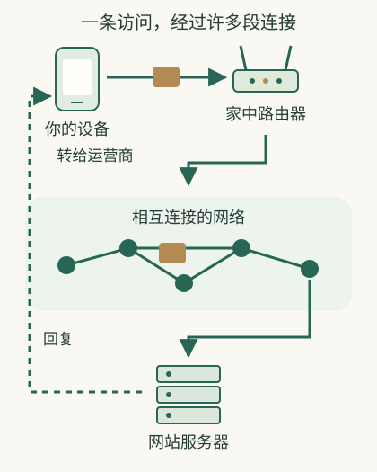

# 从一次上网出发，建立完整的网络地图

你点开朋友发来的商品链接，看到图片，登录账号，下单。出门后从家里的Wi-Fi切到手机流量，账号还在；到了公司，某个内部网页只有连VPN才能打开。**打开网页、登录账号、切换网络和连接VPN，会影响这次上网的不同步骤。把这些步骤连起来，才能解释为什么某个功能能用，另一个却不能用。**

这份知识库从你的动作出发，把过程展开。你不需要背设置参数。先看浏览器怎样请求页面、网络怎样把请求送到网站、网站怎样查资料并回复，再看切换网络或登录账号会改变什么。

## 先跟着一段日常经历走

下面以一个**虚构的购物网站**为例，网址、商品编号与结果仅用于教学。它代表常见网页工作方式，不是某个平台的内部实现说明。

朋友发来 `https://shop.example.com/products/42?color=blue#reviews`。你看到的是一整串文字，浏览器却会把它拆开：按HTTPS方式访问shop.example.com这个网站，请求42号商品的蓝色款，收到页面后滚动到评价区。HTTPS的作用是保护浏览器与网站之间传送的内容。拆分过程见[读懂一条网址](24-url.md)。

然后你的电脑必须能联系外面。电脑先通过Wi-Fi连接家里的路由器，路由器再把请求转送到运营商的网络。无线信号满格表示电脑收到的Wi-Fi信号强，不能证明网站已经回应；手机热点则换了一条接入路径。见[Wi-Fi与手机网络](02-access.md)。

浏览器通过DNS查询网站的IP地址，再联系网站接收网页请求的端口。IP帮助沿途设备把信息送到目标；端口帮助目标设备把收到的信息交给相应程序。名字和地址并不一一对应。见[IP](04-ip.md)、[端口](25-ports.md)、[域名与名称查询](06-dns.md)。

沿途许多设备接力转送小份信息。它们通常不理解你要买哪种颜色，而是按网络地址转发。你的浏览器与服务还要处理丢失、保护传输内容，才能交换完整的网页请求和回答。见[分包](03-packets.md)、[路由](07-routes.md)、[交付](08-delivery.md)。

网站接收请求后，才解释“42号商品、蓝色”。网站发回页面的文字、结构说明等内容，浏览器继续下载图片，并按页面的排版要求显示出来。此时出现商品页面，登录和下单还没有自动完成。[完整访问过程](28-browsing.md)会把这几段放在一起看。

登录成功后，网站给浏览器一个登录标记，用来识别后续请求来自哪个账号。你点下单时，浏览器另发请求，提交商品等信息。网站核对账号权限、库存等条件，创建订单后再发回结果。手机切换网络后IP可能变化，浏览器保存的登录标记仍可让网站找到同一个账号。见[网站怎样认得你](14-identity.md)、[操作何时完成](29-transactions.md)。

图示是常见访问旅程的简化，不包含所有通信安排；不同应用可以采用不同连接和服务组织。

## 把六个问题放回自己的位置

| 你想问的事 | 哪一段在负责 | 生活中会见到的现象 |
|---|---|---|
| 设备有没有接上外面？ | 电脑连接路由器，路由器连接外部网络 | 有Wi-Fi却无法上网；换热点后可用 |
| 信息往哪里送？ | 名称查询、IP和路由 | 名称查不到；换网访问结果不同 |
| 接收设备的哪个服务回答？ | 目标设备按端口把通信交给程序 | IP一样，不同端口可能联系不同服务 |
| 想取哪个页面、提交什么？ | 浏览器在请求中写明路径、参数等信息 | 路径、参数变化；页面按钮发起新操作 |
| 你是否有权、事情是否办成？ | 网站核对账号并处理订单等操作 | 需要登录；订单失败；触发额外验证 |
| 屏幕显示成什么？ | 浏览器与应用 | 页面已经出现，图片或某个按钮却失效 |

一次上网要经过这些步骤。遇到“网页打不开”，先分清是完全收不到网站回复，还是网站回复了“请登录”或“没有权限”；不能一概归为网速，也不能一看登录失败就认为IP被封。[网络与软件的关系](30-boundaries.md)专门解释这些界限。

## 为什么换网络、换VPN会改变结果

换Wi-Fi或手机流量，主要改变你接入外面的路径及可能的出口地址；网址里的商品编号并不会随之改变。平台可能根据来源变化要求验证，但那是平台判断，不是IP自动控制账号。

VPN让指定的访问先传到VPN服务器，再由那里联系目标。它可能只让你进公司内网，也可能更换公共上网出口。不能从“已连接”推断所有软件都改了出口，更不能推断登录记录消失。[VPN](16-vpn.md)、[配置与验证](18-setup.md)把两种目的完整展开。

这里有三个可以同时成立的结果：商品页能打开，公司报销页打不开；VPN连接后报销页打开，普通上网IP没变；你换了公网IP，商品网站依然认得账号。公司VPN可能只转送内部系统的访问，购物网站仍通过浏览器保存的登录标记识别账号。因此这三个结果可以同时出现。

## 可以怎么读这份地图

想先建立整体框架，可以从[浏览器、网络和网站的关系](30-boundaries.md)读到[网址拆分](24-url.md)，再沿“接入→地址→访问→业务→身份→改路径”展开。各篇末尾都有接回整条过程的线索。

最贴近日常网址的短路线是：[网址整体](24-url.md) → [IP](04-ip.md) → [端口](25-ports.md) → [域名层级](26-domains.md) → [路径与参数](27-url-pages.md) → [一次完整网页访问](28-browsing.md)。你可以跳读，目录始终完整可见。

如果眼前就有具体问题，从[访问失败](19-troubleshoot.md)、[验证码与风控](15-risk.md)、[VPN配置](18-setup.md)、[远程访问](20-remote.md)或[分享自己的网页](21-deploy.md)进入，再回看对应机制。无需提交练习，也没有完成率。

随着阅读，你要逐渐能描述的是：“我做了什么，信息经过哪里，哪个服务作出判断，结果怎么回来。”这比单独记住每个名称更能帮你理解下一次遇到的新场景。
