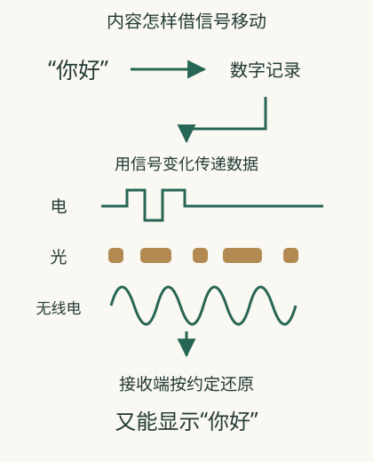

# 文字和声音，怎么进入电线与空气？

一张照片不会以“画面”的形态钻进网线。**设备先把内容记成数字，再让物理信号携带这些数字，另一端按约定恢复。** 发送文字、照片和声音，共同依靠这条转换链。

## 从录一段语音开始看转换

你按住聊天软件的录音按钮，麦克风先把声音变化交给设备记录。聊天软件把录下的声音保存为数据，可能先压缩，再交给手机的网络功能发送。手机通过无线电把数据传给附近的Wi-Fi接入点或移动网络设施，后面的设备再通过网线、光纤等继续转送。

朋友收到的不是空气中那一道相同声波，而是用于恢复声音的数据。应用按格式解码、交给扬声器播放，才形成他听到的新声音。这就是为什么同一段语音能存下来、隔一天再听，也能从手机无线连接转到有线电脑；声音已经被记录成数据，不必随着录音时那一道声波一起传播。

这里还有三种容易混在一起的处理：编码解决“怎样表示”，压缩解决“怎样少占体积”，加密解决“谁能读”。语音体积小，可能因为压缩；看不懂一串数据，可能因为格式未解释，不能直接判定已加密。

## 图片很清楚，为什么发出去以后变糊

在一个**虚构教学场景**中，你拍的原图很清楚，聊天软件的默认发送却选择压缩版。朋友收到完整文件，仍比原图模糊。这里变差发生在内容准备阶段，不一定是网络“路上把像素磨掉了”。

换成发送原文件，体积通常增大，传送可能更久；网络传送的是聊天软件选中的那个文件。若完整下载的原文件仍打不开，则还要看格式、文件是否正确或接收软件能否解释。不能把模糊、缺失与格式不支持当同一个故障。

这也解释了为什么“重新发送”未必改善画质：如果应用仍选择同样压缩规则，再传一次也没有恢复被丢掉的细节。你要先确定变化发生在准备内容、搬运内容，还是显示内容。

## 先把内容变成可以记录的东西

文字可以按约定转换为数字编号；图片可以记录各个位置的颜色；声音可以记录不同时刻的变化。这里的“编码”就是用某种约定表示内容。文件里的数字本身没有意义，两端要知道该怎样解释它们。

例如，接收端若把图片记录当作文字解释，读不出原来的画面。所以正确收到数字和正确理解格式，也是两项工作。

## 数字要借真实的载体移动

电线中的电信号、光纤中的光信号、空气中的无线电，都能通过可区分的变化传递信息。Wi-Fi就是用无线电连接附近设备的一种方式。[Cisco对Wi-Fi的解释](https://www.cisco.com/site/us/en/learn/topics/networking/what-is-a-wi-fi-network.html)

并不是一个数字一定对应一次简单亮灭。实际系统可以用多种变化组合表示信息，还会帮助接收端发现某些错误。理解时先保留一件事：发送端按规则制造变化，接收端按同样规则识别变化。

## 换一种道路，内容可以继续前进

手机到接入点可能走无线电，接入点之后可能接到网线和光纤。中间设备接收信息后，用下一段道路的方式继续发送。因此，一次访问可以经过多种物理载体。

电、光或无线电信号负责携带数据，并不理解一句话的意思。设备恢复数字后，应用才按格式把它显示为文字或播放成声音。网络还要额外知道把信息交给谁，这由[地址](04-ip.md)和转送规则帮助完成。

## 为什么压缩和加密是两件事

压缩通过表示方式减少需要传递的内容量，图片或声音还可能舍弃某些细节来减小体积。加密则让没有对应密钥的人难以读懂内容。较小不等于受到保护，受到保护也不等于文件更小。传输保护见[哪些内容能被看见](13-security.md)。

这段过程可以按三步理解：设备记录内容，网络传送数据，接收软件把数据还原为可看的图片或可听的声音。这个模型能解释照片为何可走光纤，也能解释接收不完整时为什么显示失败。它不代表实际线路上只出现简单的0与1亮灭。

## 相关概念

- [怎样接入网络](02-access.md)
- [为什么分成小份](03-packets.md)
