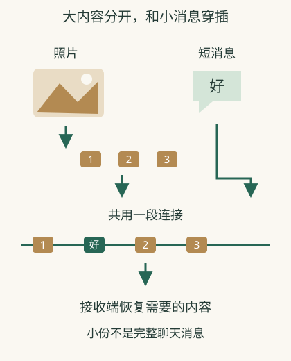

# 一张照片为什么要分成许多小份？

一条道路上有照片、消息和视频通话同时经过。如果任何一个大文件从开始到结束独占道路，其他访问就要等很久。**网络把信息组织成较小的传送单位，让许多访问穿插使用连接。** 这些单位通常称为数据包。

## 上传照片时，同时发一句“稍等”

你在聊天软件上传一组大照片，接着发一条短文字。设备可以把照片的数据分段发送，也可以在段与段之间发送文字或其他应用的数据。因此照片上传时，其他通信仍有机会使用同一条连接。

每个数据包带有目的地址等信息，沿途设备据此转送。接收设备还要判断它属于哪条连接。聊天软件则在自己的请求中写明朋友的账号；仅有聊天服务器的IP，还不能说明消息要发给哪位朋友。[端口与连接](25-ports.md)解释交给哪个接收程序，[消息服务](10-messages.md)解释交给哪个账号。

## 少一小份，不等于永远少照片的某一角

一张图片文件的字节记录和屏幕像素不是“每个包固定装某块图”的简单对应。传输机制可能补回缺失的数据，再交给应用解析图片文件。显示结果取决于恢复后的文件和应用怎样读取它。成功恢复后，用户不必看见中间曾经缺的那一份。

**虚构教学对照**：上传过程中无线信号短暂变差，软件先停在某个百分比，恢复后继续完成。可能是部分数据正在等待补发，聊天软件仍保留着上传任务；百分比并不能告诉你具体哪个包丢了，更不能证明每次恢复都从原位置续传。应用是否支持续传有自己的设计。

## 分包并没有自动分出独立快车道

多份信息仍可能共用同一窄出口。短消息虽然小，也可能在队列后等待，或者应用先排队处理其他任务；因此大文件上传时聊天和会议都慢，并不反驳分包机制。

分包让网络有机会轮流传送不同应用的数据，但不保证每个人都得到固定的速度。中间设备怎样调度、链路容量多大、应用如何等待，都继续影响结果。看到“同时下载”时，要想到共享与排队，而不是几条互不相干的无限线路。

## 每份都需要交付线索

一个包不只装内容，还带着帮助转送的说明，例如目的地址。中间设备据此把它交到下一段连接。地址格式与交付规则属于“协议”——通信两边约定怎样组织和处理信息。[IP的交付范围](https://www.rfc-editor.org/rfc/rfc791.html)

包与照片不是一一对应关系。一张照片可以跨很多包，一个应用动作也可能产生多次通信。不要把“发送一条消息”想成沿途只送出一个完整信封。

## 小份可以交错，但道路仍有上限

照片的几份内容之间，可以穿插别人的短消息。这样资源能被共享。但如果到达的份数长期超过某段道路能送出的份数，那里仍会排队，缓冲满时还可能丢弃。

分包只是组织传送的方法，不承诺不会拥堵，也不保证每份一定到达。不同包可能走同一路径，路径变化时也可能经过不同节点；不能从“分包”推断“必定分走多条路”。

## 分开传，不等于显示碎片

应用最终要的是一张可打开的照片。接收端的传输与应用机制会按各自规则恢复连续数据、解析文件；有需要时还会处理丢失与顺序变化。[TCP提供有序字节流](https://www.rfc-editor.org/rfc/rfc9293.html)

下载文件时，接收端通常要等需要的数据补齐，才能交给应用使用。“分包”描述的是数据的组织方式；线上传播的仍是电、光或无线电信号，数据包不是在空气中飞行的实体小块。

## 相关概念

- [信息丢失怎样恢复](08-delivery.md)
- [为什么带宽很高仍然慢](12-speed.md)
