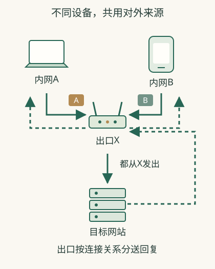

# 电脑的IP与网站看到的IP，为什么不一样？

你查看电脑网络设置，得到一个地址；打开IP查询网页，又看到另一个地址。**在常见的共享IPv4网络里，前者是内部地址，后者是这次访问经过的对外出口。**

## 两个人同时购物，回复怎么回到正确电脑

在一个**虚构家庭示例**里，电脑A和手机B同时打开同一商品站。两台设备有不同内部地址和连接信息，家中出口转送时记录对应关系，把它们的来源改为对外地址，并用端口等线索区分通信。

网站把回复送回家里的公网地址后，路由器根据保存的对应关系，把A的回复交给A，把B的回复交给B。它不是拆开网页看“这是小林的订单”再转发，而是按连接映射处理。路由器的记录用来转送回复。至于哪个账号拥有哪些订单，由购物网站根据浏览器发来的登录标记核对。

因此两个人查询公网IP可能相同，购物车却不同。反过来，你切热点后来源改变，账号和购物车也可能继续保留。共享出口与账号系统可以同时工作，不需要一人固定一个公网地址。

## 为什么我能出去，朋友却不能主动进来

你先访问网站，出口就有返回通信所需的记录。朋友从外面主动访问家中某个服务，是新来的连接，出口并不自动知道把它交给谁，也未必允许这种访问。你主动访问网站后接收它的回复，不等于允许任何外部设备主动访问家里的服务。

“端口转发”是让路由器把发往某个公网端口的请求，转给家中指定设备的指定端口。公网一侧与内网一侧的端口可以不同。它并不是换一个数字就能消除所有边界：程序仍须运行、允许接收，上游也须把访问送到你的出口。

若运营商还在家庭出口前安排共享地址，仅修改家里路由器的端口转发，外部请求仍可能到不了家里，因为运营商还在前面做了一次共享地址转换。远程访问可以采用[获准的私有连接](20-remote.md)，公共网页则可由[托管入口](21-deploy.md)承担接收。

## 固定、共享和地域，是不同属性

把内部地址固定为192.168.1.20，只是让家庭网络里的定位稳定；它不会自动把外部来源固定。购买某种公共出口服务时，也要分清地址是否固定、是否共用、由什么网络提供、访问范围是什么。

同IP的访问可能汇集全办公室或更多家庭，平台按IP计数时自然会一起看到。平台可以用IP统计访问量，却不能仅凭这个统计认定所有访问都来自同一个人。[风控](15-risk.md)要在这一事实基础上解释，不能把“多人共用”写成所有网络都必然如此。

## 几台设备，怎样共用一个出口

家中电脑、手机可以有不同内部地址，路由器把它们的访问转换成同一个公网来源。回复回来后，还要分清交给哪台设备、哪次连接。负责这种转换与映射的机制叫NAT。[共享IPv4地址的机制](https://www.rfc-editor.org/rfc/rfc6269.html)

下面的教学示意把地址写成“电脑A、手机B、出口X”，避免数字遮住关系。关键是出口保存了连接的对应关系，回复不会因为共享一个公网地址就随机分给家中设备。

## 网站只看到门口，可能看不到屋内

两台设备都通过X访问网站，网站便可能观察到同一来源X。IP查询页只能报告它接收到的访问来源，不能直接枚举你家里所有地址。

运营商也可能把更多家庭的连接汇集到共享出口；公司、校园和VPN服务同样可能让很多人共用来源。因此，来源IP相同，可能只是因为用了同一个出口，不能单独说明账号属于同一个人。

## 静态与动态，说的是会不会变化

固定保留的地址常称静态IP，按接入安排可能改变的常称动态IP。动态不代表每次刷新网页都变，静态也不代表只给一个人用。地址是否固定与是否共享，是两项不同属性。

把电脑的内部地址设为固定，也不会自动把它变成公网地址。你只改变了内部地址安排，对外入口还取决于上游网络。

## 为什么外面的人不能照着内部地址找到你

内部地址可以在不同家庭重复。朋友在自己的家里输入你家的内部地址，通常不会自动抵达你家。共享出口通常依照已建立的出站连接处理回复，也不会把所有外来的新连接转送进屋。[出站与主动入站的区别](https://docs.aws.amazon.com/vpc/latest/userguide/vpc-nat-gateway.html)

这解释了“我能打开别人的网站，别人却打不开我电脑里的服务”。要让指定设备远程访问，见[远程连接](20-remote.md)；要发布公共网页，见[部署与访问](21-deploy.md)。

## IPv6让这张图多了一种可能

使用IPv6时，设备常能各自拥有公网地址，不必把所有设备都藏在同一个IPv4出口后面。不过，访问是否允许仍取决于防火墙、路由和程序。查到自己的公网IPv6，也不能直接判定自己的所有服务对外开放。

## 相关概念

- [IP为什么不能独立证明是谁](14-identity.md)
- [共享出口与风控](15-risk.md)
