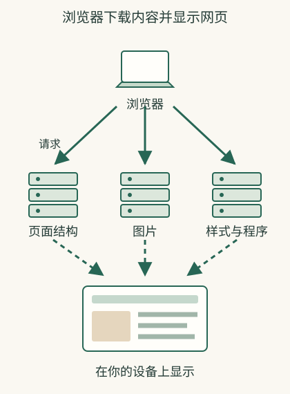

# 打开一个网页，背后是谁在回答？

你输入网址后，屏幕上的网页通常不是一次收到的完整图片。**网站先发回页面的文字和结构说明。浏览器按说明继续下载图片、排版规则和页面程序，再在你的设备上显示网页。**

## 用商品页上的图片和按钮区分三种工作

在一个**虚构商品站**里，你先看见标题，随后商品图片出现，点击“查看运费”才得到另一个结果。标题和图片可以分开下载。点击“查看运费”时，页面程序又向网站发了一次请求。所以网页是逐步下载、显示和更新的，不是从远处收到的一整张截图。

浏览器负责显示与交互，远处服务负责提供内容或处理业务。网站给回的页面描述叫HTML，样式常由CSS描述，程序常由JavaScript运行；这些名字可以先理解为内容结构、外观规则和操作逻辑，不必学写代码。浏览器读取这些内容，按照排版规则显示页面，运行按钮等功能的程序；网络负责把这些内容传过来。

## 网站收到请求后，还可能交给其他程序

浏览器可能先联系网站统一接收请求的服务器，再由它把商品查询、登录、下单分别交给不同程序。收到商品页，不代表登录和下单程序此时也都正常。

例如页面可以从shop.example.com下载，图片从img.example.com下载，库存从api.example.com查询。这些名称由网站管理者安排，也可以把三个功能放在同一主机名下，用不同路径区分。因此文字正常、图片失败、下单失败可以是不同通信或业务环节。

## 缓存和CDN怎样改变你看到的过程

浏览器已有可用图片，就可能直接显示；CDN在不同地点安排服务器。如果其中一台保存着可用副本，浏览器就可以从那里下载，不必每次都找网站最初保存文件的服务器。CDN既可以分发图片等文件，也可以转送其他请求。

**教学对照**：你断网后，已打开商品页的图片仍在，但点击实时库存失败。图片已经保存在电脑里或显示在屏幕上；查询实时库存却还需要网站回复。这能解释“页面明明在，为什么说没网络”。有内容的缓存还需按规则核对新鲜度，不能拿旧价格代替业务最终确认。

## 同一网页里，哪些属于本地变化

展开说明、滚动到评价、切换已经取得的图片，可能只在本地处理；加入购物车或查询订单，通常还要联系服务。地址栏改变不保证请求发生，地址栏不变也不保证没有请求。

具体操作由页面程序设计。判断时要看按钮具体做什么：展开已有文字可以在本机完成，查询最新订单则需要网站回复。不能只看按钮的外观。详细网址差异见[路径参数](27-url-pages.md)，完整顺序见[从点击到页面](28-browsing.md)。

## 从找到地址，到收到页面内容

没有可复用连接或缓存时，常见过程是：查询名称，联系网站，建立用于HTTPS的受保护连接，发出网页请求，取得响应，再请求图片、样式等资源。实际浏览器会复用连接、缓存或并行工作，所以顺序不是每次都完全重来。

HTTP就是客户端与服务端组织请求和响应的一套规则。请求说明想取得或执行什么，网站在响应中发回页面内容或操作结果。[网页通信的组成](https://developer.mozilla.org/en-US/docs/Web/HTTP/Guides/Overview)

## 服务器并不住在屏幕里

浏览器在你的设备上工作，服务器是远处提供服务的计算机与程序。服务器可以交回静态文件，也可以根据账号与资料生成结果。你看到按钮，并不意味着按钮要做的全部工作已经完成。

以下是**虚构教学示意**：页面先显示按钮；你点“查看订单”，才发出另一次请求。网页外壳可以正常出现，订单服务却暂时失败。这种情况下不能说“网页开了，所以网络与所有功能都没问题”。

## 一张页面，可以从多个地方下载内容

图片、视频与登录请求可以发往不同服务器。CDN会在不同地点安排服务器：已有可用副本时，可以直接提供文件；需要实时查询时，可以把请求转给网站后台程序。

缓存是保留副本并在规则允许时再次使用。它能减少重复获取，但需要检查是否还新鲜，或向原服务确认。[缓存如何复用响应](https://www.rfc-editor.org/rfc/rfc9111.html)

## 为什么刷新，也未必看到最新内容

浏览器、分发设施、应用都可能保存副本。刷新触发了新的动作，不保证每个环节都重新下载所有文件。内容更新慢时，要区分名称地址仍旧、内容副本仍旧和服务根本没更新；这是不同原因。

打开网页的完整模型是“找到服务 → 请求页面内容 → 收到回复 → 显示网页 → 按操作继续通信”。理解这条链，比把网站想成远方电脑的一张截图更接近实际。

## 相关概念

- [名称查询](06-dns.md)
- [网站怎样识别会话](14-identity.md)
- [自己的网页怎样对外可达](21-deploy.md)
