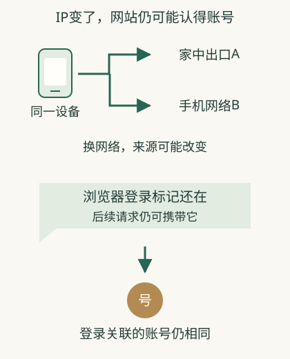

# 换了IP，网站为什么还认得你？

你从Wi-Fi换到手机流量，网站仍显示自己的账号。**IP说明这次访问从哪个网络地址来；浏览器保存的登录标记则可以让网站找到你的账号。换了网络，登录标记可能还在。** 更换其中一项，其他项不一定消失。

## 在同一条商品链接上，网站怎样知道订单属于你

用一个**虚构购物系统**展开：第一次进入时，你可能只有一个未登录会话。登录成功后，服务把会话关联到账号，浏览器保存相应标记。之后点击“我的订单”，请求附上这个标记，服务从自己的记录找出账号，再核对订单权限。

标记可以是不含姓名的编号，账号资料保存在服务端。浏览器不能自己随意宣告“我是小林”就得到小林订单；服务要验证这份标记是否有效、过期、已撤销以及是否拥有相应权限。

你切到热点后来源IP变了，保存的标记可能仍有效，所以网站继续显示账号。网站用原有登录标记找到了账号，并不需要“通过新IP猜出你是谁”。若服务要求重新验证，它可能在评估会话和风险，具体由其规则决定。

## 同一个办公室，是一个来源却有许多账号

几个人共用公网出口，各自在浏览器中保留自己的会话。网站虽然看见同一个来源IP，仍可以通过不同登录标记区分账号。平台如果只按IP统计，会把多人的操作合起来；如果还看会话，就有更多分辨线索。

这些线索也不保证唯一定位自然人：账号可由多人按授权共享，一个人可用多个设备，浏览器特征可能相似。业务记录“某账号执行过操作”和“某个自然人亲自做了操作”之间仍可能需要其他证据。

## 为什么换子域名、换浏览器，登录状态会不同

浏览器保存的数据有发送范围。某个Cookie可以只用于当前主机，另一个可以按合适父域名范围使用，路径等条件也会限制发送。这些安排不等于所有同品牌页面必然共享会话。

换另一个浏览器，新浏览器没有自动复制原会话；打开网站可能先要求登录。若再登录同一账号，服务器仍能展示同一账号下已有资料。清本地标记改变的是这段访问的凭据，不是把远处数据库的账号删除。

[子域名与同源](26-domains.md)解释页面安全边界，Cookie规则与之有联系但并不相同。退出登录也应由应用处理会话撤销，而不是只凭地址栏变了就判断已经退出。

## 设备指纹为什么只能作为关联线索

浏览器类型、语言、设备环境及其他可得特征可能形成组合，用来判断访问是否可能相关。升级系统、改设置会改变特征，不同设备也可能相似；这些特征只能帮助关联访问；网站核对登录凭据，才是在验证账号。

你理解网站认人时，可以把一条访问展开为来源IP、携带标记、验证账号、设备环境、实际行为。风控使用它们联合推断，登录系统核对登录标记等凭据；不能把其中任何一个都叫作精确永久“身份”。

## 网站怎样把连续操作接起来

网页通信中，每次请求都要说明想做什么。网站还需要把“登录成功”“查看订单”等操作关联起来。常见方法是给这段访问一个会话标记，让浏览器保存并在后续请求中附带它。

Cookie就是浏览器按规则保存并发送给对应网站的一类数据。网站可用它保存会话标记，再从服务器记录中找出访问状态。[浏览器如何保存与发送Cookie](https://developer.mozilla.org/en-US/docs/Web/HTTP/Guides/Cookies)

这不是每个Cookie都直接写着姓名；有些只存一个关联编号，有些用途与登录无关。

## 同一个人，不必来自同一个网络

你换了接入网络，来源IP可能变了，浏览器里的会话标记还在，网站便可能继续找到同一会话。再次登录同一个账号，即使换了设备，也能关联到同一账号记录。

反过来，多个人可能在办公室共用一个来源IP，各自却有独立会话和账号。[共享IP的识别问题](https://www.rfc-editor.org/rfc/rfc6269.html) 网络地址适合做来源线索，不能代替密码、登录标记等账号验证。

## 设备指纹是在做怎样的判断

浏览器与设备特征也可能被用于关联访问。这类特征组合常被称为设备指纹。它们可能提供识别线索，但不是不可改变的硬件身份证；不同设备可能相似，升级也可能改变特征。

风险产品可接收浏览器、语言、会话等资料。[MaxMind公开的设备输入](https://support.maxmind.com/knowledge-base/articles/device-inputs-minfraud) 哪个平台用了哪些组合、怎样比较，必须以该平台信息为准。

## 换IP、清Cookie、退出登录，分别改变什么

| 动作 | 主要改变的东西 | 不自动做到的事情 |
|---|---|---|
| 换网络或出口 | 某些访问的来源 | 删除网站账号或历史 |
| 清除网站Cookie | 浏览器保存的标记 | 删除服务器已有记录 |
| 退出登录 | 网站允许当前浏览器使用的登录状态 | 保证所有来源线索都消失 |
| 换设备 | 设备与本地资料 | 保证同一账号无法关联 |

实际效果受网站会话设计影响。理解身份时，可以先问三个问题：从哪个网络来，携带了哪个访问标记，网站验证的是哪个账号。它们有联系，但不能互相替代。

## 相关概念

- [IP怎样用于风控](15-risk.md)
- [VPN保护与身份边界](16-vpn.md)
