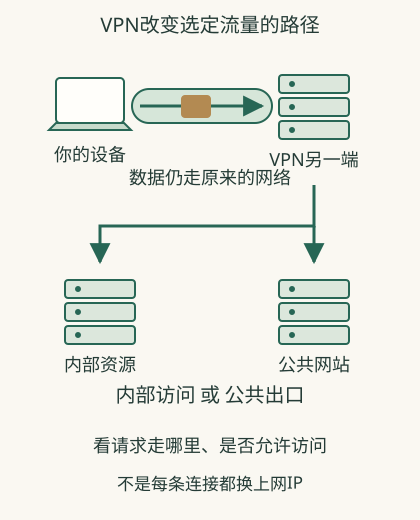

# VPN究竟改变了哪一段通信？

**VPN先通过你现有的网络连接VPN服务器。随后，指定的访问可以先传到这台服务器，再由它联系公司内部系统或外部网站。** VPN服务器在哪里、哪些请求经过它，决定了你能访问什么，以及网站看到的来源IP是否改变。

VPN把要传送的数据包在一层受保护的通信中，先送到VPN另一端。这常被叫作“隧道”。它仍使用原来的Wi-Fi、网线或移动网络传送，原网络断了，隧道也无法继续通信。

## 同一个“连接成功”，可以满足两种完全不同的生活目标

**虚构公司场景**：你在家能逛购物站，却进不了内部报销页。公司VPN先确认你获准加入，建立到公司VPN服务器的连接，电脑再通过这条连接发送访问报销系统的请求。报销服务继续检查你的账号和权限，页面才出现。

普通购物访问如果不在该连接范围，仍经家庭出口。于是报销页恢复、公网IP查询不变，都可以与VPN有效同时成立；验证这项用途，应看报销页面能否打开，以及你的账号能否使用它。

**虚构公共出口场景**：你想让选定浏览器访问经某处出口。浏览器的目标通信进入隧道，在另一端再向购物站发出，站点通常观察到出口来源。这里验证的是这项访问从哪里出来，不是公司内部系统权限。

## 隧道内外，同时有不同目标

设备先把受保护的VPN通信送到VPN服务器。服务器解开这一层，再把里面的请求送向报销系统或购物网站。沿途设备先看到的目标是VPN服务器，最终访问目标则在里面。它没有让原来的Wi-Fi和运营商从路径里消失，只改变了哪些信息受保护以及后续经过哪里。

VPN提供者需要运行VPN服务器。你的设备必须能通过现有网络联系它，并按要求登录或通过其他验证。VPN连接本身失败时，目标网页和风控不必已经参与；连接成功后网页失败，又是另一阶段。

## 为什么切节点可能改变速度和提示

切换另一端，会改变先抵达哪处网络、后半段怎样互联、外部可能观察到的来源。某条目标路径可能改善，也可能绕得更远；出口共用活动和地区线索也可能变化。

账号会话却不因这一变化自动删除，平台仍可关联之前账号。VPN可以带来正常工作和隐私用途，也可能被某些服务要求验证；不能承诺开启后统一变快或不被识别。

## 连上VPN以后，目标系统仍要检查权限

私有连接让成员设备能够联系彼此，但目标设备上的文件或网页程序仍要运行、接收请求，并允许你的账号使用。公共出口替你转送上网访问，购物站也仍可拒绝某项操作。VPN帮助请求到达目标，文件或网页程序仍会核对账号和权限。

使用VPN时，先说清要访问公司系统，还是更换上网出口；再看哪些请求经过它，最后在目标应用里检查结果。具体设置见[配置](18-setup.md)，范围见[分流](17-split.md)，自有设备场景见[远程访问](20-remote.md)。

## 用途一：联系内部设备

公司内网系统或自己的设备，未必向整个互联网开放。VPN可以让管理员允许的设备联系内部系统或其他成员设备。普通浏览网页的流量可以继续走原来出口。

因此，VPN连接成功、内部系统可用、IP查询页地址没变，可以同时成立。Tailscale的普通覆盖网络就主要连接成员设备，公共上网不默认通过另一台设备。[内部连接与出口的区别](https://tailscale.com/docs/features/exit-nodes)

## 用途二：经另一处出口上网

若选定流量经VPN另一端访问公共互联网，VPN另一端就充当上网出口。目标服务看到的来源通常是出口的公网地址，回复先返回出口，再经连接送回你。

这里改变的是访问路径与观察到的来源。只给部分应用或目标这样安排，就只影响对应访问。直接走原路径的流量仍可能显示原来源。

## 原来的网络承担什么

你的设备仍需要先联系VPN服务器或另一端。附近Wi-Fi或移动网络中断后，隧道也无法凭空继续工作。到VPN另一端的距离、网络互联情况，以及当时传送的数据量，还会影响体验。

绕经另一处可能让某条路径更适合，也可能更慢。不能仅凭VPN开启推断网络一定更快。

## 它保护谁看不到哪段内容

隧道保护覆盖其两端之间；HTTPS可以同时保护浏览器与网页服务之间的内容。VPN出口仍负责向目标转送，网站仍可能看见账号与会话。[传输保护的边界](https://developer.mozilla.org/en-US/docs/Web/Security/Defenses/Transport_Layer_Security)

VPN不会自动删除登录记录，也不保证所有目的信息对提供者不可见。评估时把三个问题分开：路径在哪里变化，哪些流量经过，哪些内容在哪段受到保护。

## 相关概念

- [分流与全局](17-split.md)
- [配置与验证](18-setup.md)
- [远程访问自有设备](20-remote.md)
