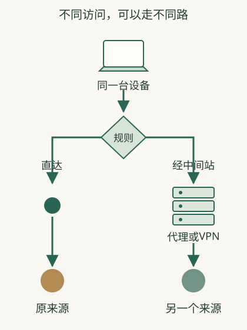

# 全局、分流、代理，为什么影响的应用不同？

你开了一个连接工具，浏览器能访问，另一个软件却不行。**不同工具和设置接管的流量范围不同；显示“开启”不能证明所有应用都经过它。**

## 浏览器好了，会议软件为什么还是原样

以下是**虚构对照**：你给浏览器设代理，商品页成功，会议软件的表现没变。浏览器把适用请求交给代理，会议软件却可能根本不读取这份设置；浏览器访问成功，不能证明会议软件也使用了代理。

系统代理让应用可以取得统一配置，但应用是否采用、哪些请求适用仍要看实现。VPN可以通过系统路由等规则，把指定的通信送入隧道。还有些工具把多种能力组合在一个界面，所以名字叫VPN的应用，其某个模式未必等于把全部流量都送入网络隧道。

## “全局”模式也需要问具体范围

规则可以按地址范围、名称、应用或其他条件分配。公司方案可能只送内部系统；公共出口方案可能尽量送公共访问，但保留本地打印机等例外。究竟哪些请求经过工具，要看产品、系统和设置。

所以全局不能只翻译为“所有电脑活动都已隐形”。你要看它指全局代理、网络出口还是某个应用范围，以及是否处理IPv4、IPv6和名称查询等实际路径。不覆盖某一类访问时，表面统一按钮也可能产生不同来源。

## 同时开几种工具，为什么更难解释

浏览器代理与系统VPN可以同时作用：请求先交给代理，访问代理的底层通信再走VPN。也可能某一项把流量排除，或者两份规则互相冲突。增加工具并不自动增加效果，反而会让同一请求先后经过多个工具，更难判断它在哪里被阻断。

**教学场景**：内部报销页原来通过公司VPN可用，启用另一个公共代理后失败。要比较是否只有内部目标受影响、是否查得到内部名称、断开新加设置是否恢复。仅凭“两个都显示已连接”不能证明组合路径正确。

## 为什么同一查IP网页也有验证边界

查IP报告的是它接收到的那次来源。如果下载软件用另一条连接、页面分别尝试IPv4和IPv6，或者内部访问本来不经公共出口，结果可能不同。应在真正目标应用中按实际任务验证，不能把浏览器的一次查询当整台设备的证明。

配置页面的“允许本地网络”“断线保护”等选项则决定例外或失败后行为。断开工具后仍无法上网，可能是保护策略仍在阻断；需要按该提供者说明恢复，不能任意删除公司受管设置。

## 先区分在什么位置转送

应用代理是在特定应用或请求中安排转送。例如浏览器设置了一个代理，浏览器将相关请求交给代理处理。其他应用是否使用它，要看各自支持与设置。

系统代理为应用提供系统层面的代理配置，但应用可能有自己的连接方式。网络层VPN则可以依据系统路由把选定流量交入隧道。浏览器代理只影响使用该设置的请求；VPN可以影响系统选中的通信。两个按钮都写“开启”，实际经过的请求仍可能不同。

Mac原生VPN还提供相应的名称查询和代理设置，具体能力随连接类型变化。[Apple对配置选项的说明](https://support.apple.com/guide/mac-help/set-up-a-vpn-connection-on-mac-mchlp2963/mac)

## 分流在做哪种决定

分流就是按规则选择访问走哪里。可能只让公司内部地址进入VPN；也可能让指定应用或目标经过公共出口，其余直达。规则要与目标配合。

“全局”常被用来表达尽可能把流量交给指定路径，但不同客户端可能指全局代理、VPN全流量出口或其他范围。仍需查看实际覆盖与排除项。[出口节点承载公共流量](https://tailscale.com/docs/features/exit-nodes)

## 为什么不能只在浏览器查一次IP

以下是**虚构教学对照**：浏览器有自己的代理，查IP显示出口X；下载工具直接走系统网络，目标看到出口Y。浏览器结果只能证明这次浏览器访问的来源，不证明下载工具的路径。

设备还可能同时使用IPv4与IPv6。工具若只覆盖部分路径，查询页与目标应用使用的路径可能不同。出现不一致时核对产品覆盖说明，而不是把所有不同都归成“失效”。

## 看见几个常见选项时怎样理解

| 名称 | 先把它翻译成什么问题 |
|---|---|
| 节点、出口 | 请求先到哪台服务器，再由它联系目标？ |
| 分流规则 | 哪些请求经过工具，哪些仍直接发送？ |
| 系统代理 | 哪些应用实际采用系统配置？ |
| 允许本地网络 | 连接后，附近设备是否仍可联系？ |
| 断线保护 | 连接断开后，相关流量是否被阻止？ |

这些名字不保证跨应用行为一致。操作时先了解目标，记录原设置，一次改变一项，在真正要使用的应用中验证。恢复办法见[配置VPN](18-setup.md)。

## 相关概念

- [隧道与出口](16-vpn.md)
- [IP与会话](14-identity.md)
