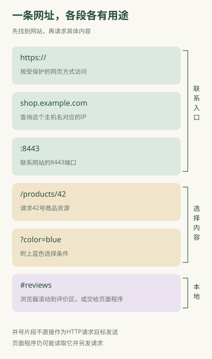

# 一条网址里的域名、端口和参数，各有什么用？

朋友发来一个链接，点击后就打开商品的蓝色款，还跳到了评价区。浏览器从链接中读出网站名称、商品编号、颜色选项，以及评价区的位置。**一条网址既说明去哪个网站，也可以说明要看什么内容。**

日常所说的网址，常叫URL。先以这个**虚构教学链接**为例：`https://shop.example.com:8443/products/42?color=blue#reviews`。实际购物网站未必使用这样的字段或端口；这里把平常会省略的部分也写出来，方便看清分工。

## 浏览器先拆开，再分别使用

开头的 `https://` 告诉浏览器按受保护的网页通信方式访问。它影响建立什么连接、怎样保护交换内容，不是网站公司名称。

`shop.example.com` 是主机名。浏览器通常先查询这个名称对应的IP地址，再尝试连接网站。这里的shop是子域名，详细层级见[域名](26-domains.md)。主机也能直接写IP，不过实际网站可能还需要正确域名才能匹配证书与站点。

`:8443` 指定服务端口，也就是浏览器要联系的端口编号；网站程序需要在这个端口接收请求。普通HTTPS网址没写端口时，使用默认的443；省略数字是采用约定，并不是没有端口。不能给普通链接任意补一个数字，服务必须在那里接收。见[IP与端口](25-ports.md)。

`/products/42` 是路径，告诉网站你要哪个资源。资源可以是商品页面，也可以是图片或供程序读取的数据；它不必是服务器硬盘上的同名文件夹。

`?color=blue` 是查询部分，给访问附上条件。在这家虚构网站，color表示颜色、blue表示蓝色。别的网站可能采用完全不同的含义；通用网络规则不负责解释“蓝色”。多个常见条件会用 `&` 分隔，例如 `?color=blue&size=m`。

`#reviews` 是片段。普通HTTP请求不会直接把这段作为请求目标送给服务；浏览器可以用它滚动到评价区，网页程序也可以拿它选择显示内容或另发请求。因此“片段不直接发送”不等于“网站永远无法知道它”。

## 如果只改变一段，通常发生什么

| 变化 | 在虚构例子中的意义 | 不能据此断定 |
|---|---|---|
| shop改成help | 改用help.example.com这个主机名 | 一定属于另一家公司 |
| 8443改成9443 | 尝试联系9443端口上的程序 | 网站会自动理解你想换页面 |
| products/42改成products/43 | 请求另一商品资源 | 一定换了IP或服务器 |
| color=blue改成color=red | 换商品选择条件 | 参数必然被接受或自动获得权限 |
| reviews改成details | 换浏览器定位或页面状态 | 一定产生新的网络请求 |

改变路径或颜色参数，通常仍是在联系同一网站。网站可以处理许多不同路径和条件，不需要每页都另用一个IP或端口。反过来，同一个域名也可以安排多个地址提供服务。网址组件的语法可以统一，背后的业务规则仍由服务决定。

## 地址栏里的网址，不是这次访问的全部信息

你登录后打开同一商品链接，看到自己的收货地址；朋友打开同一链接，看不到你的地址。原因是访问还可能携带浏览器保存的登录标记，以及服务已保存的账号信息。网址虽然相同，浏览器附带的登录标记却可能不同，网站就会按不同账号回复。

搜索关键词常放在问号后，但上传文件、填写地址、提交密码等内容通常放在请求的其他部分；地址栏看不见不等于没有传送。参数如果包含分享凭证或个人资料，复制链接也可能把这些信息一起给别人。理解链接时，既要看它指向什么内容，也要看它是否带着分享凭证等信息。

## 你还会碰见省略写法与编码

网页里的链接有时只写 `/products/42`。浏览器会用当前页面的网址补全，因而你仍可跳转。它不是一个能脱离所在页面、到处都正确工作的独立网站地址。

中文和空格有时会显示成 `%` 后接字符的串，这是网址中的编码表示。浏览器与服务按规则恢复相应文本；不能把它误认成加密保护。短链接则是另一个入口，它往往通过跳转把你引向更长网址，见[完整访问过程](28-browsing.md)。

读一条陌生链接时，先找 `://` 后、第一个 `/` 前的网站名称与可选端口，再看路径、问号和井号后的内容。前面说明要联系哪里，后面说明要查看什么、附带什么条件，以及怎样在页面中定位。组件规则可核对[MDN网址说明](https://developer.mozilla.org/en-US/docs/Learn_web_development/Howto/Web_mechanics/What_is_a_URL)与[URI语法规范](https://www.rfc-editor.org/rfc/rfc3986.html)。
