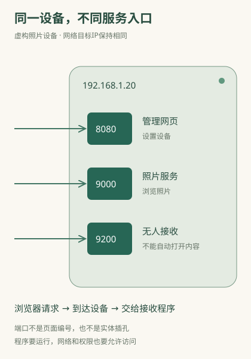

# 知道IP后，为什么还要写端口？

你在浏览器里见过 `http://192.168.1.20:8080`，也见过 `localhost:3000`。冒号后面的数字是端口。**IP帮助数据到达目标设备的网络接口，端口帮助设备把数据交给相应程序或连接。** 只有地址还不足以说明要联系哪项服务。

这些地址是教学示例，不要求你实际打开或修改。一个设备上可以同时运行网页、文件共享、远程控制等程序；它们需要分别接住属于自己的通信。

## 同一设备上，不同程序可以使用不同端口

下面是一台**虚构家用设备**：管理网页在8080接收，照片展示服务在9000接收。你用同一个IP加不同端口，就可能进入不同服务。把8080改成9000不是“翻到同一网站第9000页”，而是在联系另一个接收入口。

程序在某个端口等待相应通信，叫“监听”。它是软件与操作系统建立的接收安排，不是电脑上新增一个实体插孔。网线接口与这里说的端口是两回事。

如果9000上根本没有程序接收，浏览器可能报连接拒绝；若防护规则或路径把信息丢掉，也可能表现为等待超时。端口数字本身没有“打开照片”的能力，必须有对应服务，且当前网络能连接它，而且访问规则允许这次请求。

## 普通网址看不到端口，为什么也能访问

HTTP通常默认80，HTTPS通常默认443，因此普通网站省略它们。`https://shop.example.com` 常可理解为使用443这个入口，不需要用户填数字。这里的默认只决定尝试哪个入口，不保证那里真的有服务。

定制服务、本地开发或设备管理页可能使用其他端口，提供者就会把它写进地址。实际采用什么数字，由接收程序与部署安排决定；把别人的教程端口照搬到自己的服务，未必成立。

访问方式也必须匹配。某端口提供普通HTTP，另一个提供HTTPS；不是换成https字样就能让对方突然支持保护连接。你收到的完整地址同时包含这两类约定。

## 端口、路径、子域名怎样一起工作

想象这家虚构网站在同一公共接收入口提供商品、订单和帮助：`/products/42`、`/orders/18`、`/help`。这些路径由已经接住请求的网站程序解释，不需要每个页面单独分配端口。

同一个接收入口也能为 `shop.example.com` 和 `help.example.com` 服务。网页请求里保留主机信息，入口可据此选择站点，再按路径选资源。因此关系不是“一个IP对应一个网站，一个端口对应一页”。[域名与多站点](26-domains.md)会接着展开。

| 你改变的内容 | 哪个环节先要重新判断 |
|---|---|
| IP地址 | 联系哪个网络目标 |
| 端口 | 该目标上哪个接收入口 |
| 主机名 | 查询哪个名称；接收入口还需识别哪个站点 |
| /后面的路径 | 站点中的哪个资源或操作 |

打开网页时，浏览器既要找到目标IP和端口，也要在请求中说明主机名、路径等信息。这些部分一起使用，各自影响不同步骤。

## 我的电脑同时开很多网页，回复怎么不混在一起

浏览器发起连接时，你这端也会使用自己的通信端口。常见TCP连接可由两端地址、两端端口区分，设备才能把回复送回相应连接。若使用UDP等不同传输方式，识别还要考虑传输方式，不能只认一个数字。

一次连接还可能承载多个网页请求，现代浏览器会复用连接。因此“每个标签页固定拥有一个永久端口”也不是准确模型。这里需要理解的是两层分工：系统把信息归到连接，浏览器再把请求结果交给对应页面。

家中多人共用公网IP时，出口还会记录端口等信息，区分回复应返回哪台设备。这就是[共享出口](05-nat.md)在地址之外必须保留通信记录的原因。

## 本机能开，为什么别人不能用同一地址打开

`localhost`指访问者当前这台设备，`127.0.0.1`是常见本机回环地址。你把自己的localhost链接发给朋友，他的浏览器会去找他自己电脑上的那个端口，不会自动找你。

即使你给出局域网IP，服务也可能只接收本机访问；即使服务接受局域网访问，外地朋友仍可能没有进入你家网络的路径。要对外提供服务，还要同时有程序正在运行、愿意接收外部请求，网络能把请求送到，并且你有权使用。见[自己的网页如何分享](21-deploy.md)。

所以拿到IP加端口时，可以依次问：目标在哪里，这个入口是什么服务，它是否在运行，我从当前网络能否到达，是否有权使用。传输端口与连接的规范依据见[TCP规范](https://www.rfc-editor.org/rfc/rfc9293.html)，网页默认入口和主机信息见[HTTP语义规范](https://www.rfc-editor.org/rfc/rfc9110.html)。
