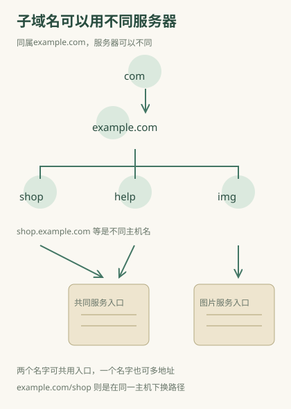

# www、shop、api：同一个网站为何有多个域名？

你打开一家网站，地址栏是 `www.example.com`，购物时变成 `shop.example.com`，图片又来自 `img.example.com`。**它们都是example.com下面的子域名，但可以指向不同服务器、运行不同程序，也可能要求分别登录。** 你眼中的同一家网站，可能用几个不同的主机名提供页面、图片和数据。

本篇用example.com这组保留示例域名说明，功能分配均为虚构教学设计。真实网站需要以实际链接和官方说明判断。

## 域名的层级要从右向左看

`com`位于顶级，`example.com`是在它下面的名称，`shop.example.com`又在example.com下面，`m.shop.example.com`还多了一层。每一个点隔开的标签增加命名层次；左侧名称在右侧名称之下。

在这组例子里，example.com通常是可注册的域名；网站管理者可以安排shop、help等子域名。子域名不是另一个页面目录，名字里的shop也不会自动生成购物功能，只是人选的名称。

“二级域名”有时按名称层级严格使用，有时在日常沟通中被拿来指子域名。听别人这样说时，最好拿到实际名称，而不是只凭叫法判断结构。对 `example.co.uk` 之类名称，可注册部分的边界不等于永远取最后两段；[公用后缀有自己的规则](https://publicsuffix.org/learn/)。

## 子域名和斜线后目录，是两种划分

`shop.example.com` 改变了主机名；`example.com/shop` 保持主机名、改变路径。shop.example.com可以在DNS中单独设置地址；example.com/shop则仍先联系example.com，网站程序收到请求后再处理/shop这个路径。

网站可以把两种做法设计成相似界面，也可以让其中一个跳转到另一个。你看见相同品牌和导航，不能据此推断底层一定相同；看到不同子域名，也不能推断一定是不同公司。

| 例子 | 改的是哪一部分 | 常见用途 |
|---|---|---|
| www.example.com | 主机名 | 主站入口；www可有可无，并非强制 |
| shop.example.com | 主机名 | 购物入口 |
| api.example.com | 主机名 | 应用取数据或执行操作的入口 |
| example.com/help | 路径 | 同一名称下的帮助资源 |
| example.com/help?page=2 | 查询条件 | 帮助资源的筛选或分页 |

api是常见的人为命名，不代表一种特殊的网络地址。它背后提供的是供程序调用的服务；普通页面也可以通过相同主机名的路径提供这些服务。

## 为什么两个域名能是同一个IP

同一台服务器可以提供多个网站。浏览器虽然联系相同IP和端口，网页访问还带着想访问的主机名，服务据此分派到shop或help。保护连接的证书也需要适合所访问的名称。

因此直接把域名换成查到的IP，有时打不开，或者出现证书错误，或者打开了另一个站点。这不证明地址查询错了，而可能是没有提供服务器选择网站或浏览器核对证书所需要的主机名。IP把请求送到服务器；主机名继续告诉服务器，浏览器要访问它提供的哪一个网站。

反方向也成立：同一个主机名可以返回多个地址，用于不同地点或负载安排。你和朋友查到的地址不同，不必就是伪造；要结合实际服务和查询环境判断。[DNS过程](06-dns.md)负责解释地址怎样查出。

## 同一品牌，为什么某个子域名还要登录

几个子域名是否共用账号，需要网站专门安排。浏览器还限制不同网站页面之间的数据读取：访问方式、主机名、端口三项相同才通常算同源。`https://shop.example.com` 和 `https://help.example.com` 的主机名不同，就不是同源。

同源用于控制页面程序读取其他来源的数据；它不意味着跨来源请求绝对不能发出。登录标记又有自身的Cookie范围规则，有的仅发给某个主机，有的可以覆盖合适的父域名范围。登录标记是否发给另一个子域名，要看Cookie的发送规则；页面能否读取另一个来源的数据，要看同源等规则；账号是否通用，则要看网站是否共用登录系统。这三件事各有条件。

所以帮助站有时自动认得账号，有时需要再次登录；这是共享登录安排与浏览器规则的结果，不能只从“都在example.com下面”推出必然结论。细节见[浏览器同源规则](https://developer.mozilla.org/en-US/docs/Web/Security/Defenses/Same-origin_policy)与[会话身份](14-identity.md)。

## 怎样读一个看起来很像官方的域名

`shop.example.com`和`example.com.other-site.net`不同。后一串的example.com在左侧名字里，整串却在other-site.net下面；不能因为开头出现熟悉名称就认成前一家网站。路径和参数也可以含某品牌的文字，仍不改变真正主机。

页面可以做得很像官方页面，但网站名称仍可能属于别的域名。确认真实服务时应核对完整主机名和已知官方入口，再考虑页面用途；HTTPS的保护不能替代这个核对。名称层级可核对[MDN域名说明](https://developer.mozilla.org/en-US/docs/Learn_web_development/Howto/Web_mechanics/What_is_a_domain_name)，来源定义见[浏览器的origin](https://developer.mozilla.org/en-US/docs/Glossary/Origin)。
