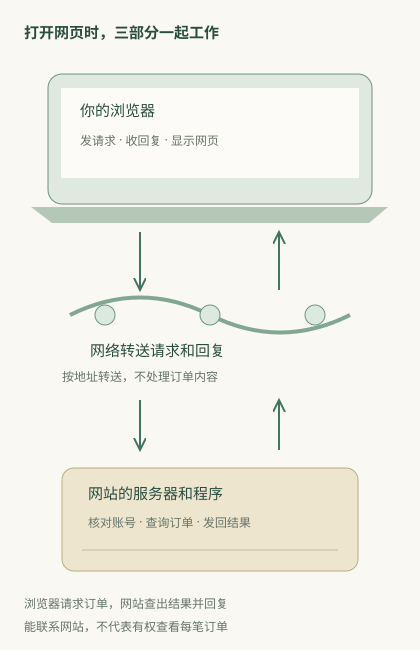

# 网络、互联网、网页和软件，分别是什么？

打开一个网页，要靠你电脑上的浏览器、连接两端的网络，以及网站的服务器一起工作。**浏览器发出请求，网络把请求送到网站；网站处理后回复，浏览器再把收到的内容显示出来。**

浏览器是软件，网站服务器上也运行着软件。网络则把这些设备连起来，让它们能够交换信息。你日常说的“上网”，就是在使用这几部分共同完成的功能。

## 先分出身边的东西与远处的服务

你在手机或电脑上打开浏览器，输入网址。浏览器会查找网站的地址、请求页面，收到文字、图片和程序后，把它们显示成网页。聊天软件、网盘和会议软件也需要收发信息，只是你使用它们时，不一定经过浏览器。

这些请求通常先经过家里的路由器，或手机连接的移动网络，再由运营商和其他网络继续转送。网站的服务器收到请求后，才会查找商品、消息、账号或文件，把你要的结果发回来。

几个名称可以这样区分：**浏览器是你用来打开网页的软件；网页是浏览器显示的内容；网站是向你提供这些页面和功能的一组服务；互联网把世界各地的网络连接起来。** 因此，你用聊天软件收消息时，也可以使用互联网，却没有打开网页。

## 用一件事看清职责

下面用一个**虚构购物网站**说明。你已经登录，点开“我的订单”，想查看一笔订单的状态。

1. 浏览器向网站发送请求，告诉它你想查看订单，并附上当前登录所需的标记。
2. 你的设备通过Wi-Fi或手机网络，把请求送到网站的服务器。
3. 网站核对登录标记，确认这笔订单是否属于你的账号。如果你有权查看，网站就查出订单状态。
4. 网站把结果发回你的设备，浏览器将它显示成订单页面。

这几步分别解决不同问题：网络负责把请求和回复送过去；网站负责确认你能不能查看、应该返回什么；浏览器负责让你看见结果。

如果网站没有收到请求，你可能一直等不到页面。如果网站收到了，却发现你还没登录，它可能要求你先登录。两种情况都可能让你“看不到订单”，但需要处理的原因不同。

页面已经显示出来，也不代表后面的操作都能成功。有时浏览器保留着之前下载的页面，点击“查看订单”时才重新联系网站；这次联系失败，旧页面仍然可以留在屏幕上。

## 你日常碰到的名称，分别在回答什么

| 名称 | 在一次访问中做什么 | 日常会遇到的例子 |
|---|---|---|
| Wi-Fi、手机流量 | 让设备接入网络 | 换成手机热点后，网页又能打开了 |
| IP地址 | 告诉网络把信息送到哪里 | 电脑、路由器和网站都有各自使用的地址 |
| 路由 | 决定信息下一步往哪里送 | 请求经过多个网络，逐段到达网站 |
| 端口 | 帮接收设备区分要联系哪个程序 | 同一IP后写8080或9000，可能联系不同程序 |
| 域名、DNS | 用网站名字查找可以联系的地址 | 输入网站名称，浏览器先查地址，再联系网站 |
| 网址的路径和参数 | 告诉网站要什么内容、带什么条件 | 商品编号、搜索词、页码、颜色选项 |
| HTTP请求和响应 | 按双方约定的格式，发送需求和结果 | 浏览器请求商品资料，网站回复商品资料 |
| 账号、会话 | 帮网站确认这次操作属于哪个账号 | 你登录后，网站能接着显示“我的订单” |
| 浏览器、页面程序 | 显示内容，处理点击，并按需要继续请求数据 | 点“查看运费”后，页面才向网站查询运费 |

这些名称不一定只参与一步。例如域名先用于查地址，后面还可用于区分网站、核对连接对象。因此，理解它们时，最好看它们在这次访问中做了什么，而不是只给它们贴上“网络”或“软件”的标签。

## 为什么“网络没问题”听起来有时不准确

朋友说“我这里能打开新闻，所以网络没问题”，说明他能联系到那家新闻网站。你的订单系统可能在另一个地址，公司内部网页也可能需要VPN；能打开新闻，不能证明这些访问也都正常。

如果网站已经显示“请重新登录”，说明你至少收到了一条回复。此时应先按网站提示核对登录状态；反复重连Wi-Fi，通常不能替你完成账号验证。

如果网页文字正常、图片不出，文字和图片可能来自不同服务器，也可能是浏览器没有正确显示图片。排查时应说清楚“文字能显示，图片加载失败”，这样才能分别检查图片的下载和显示过程。

## 把这张地图用在下一次遇到的新东西上

以后看到陌生名称，先把它放回具体操作。例如：你点了哪个链接，浏览器准备联系哪里，网站收到后处理什么，最后屏幕上出现了什么？找到它参与的步骤，再读定义会容易得多。

[网址](24-url.md)解释一条链接怎样指定访问内容；[IP](04-ip.md)和[端口](25-ports.md)解释请求怎样找到接收它的设备和程序；[完整访问](28-browsing.md)把这些步骤连起来；[业务完成](29-transactions.md)解释为什么点了“提交”，事情还不一定办成。

互联网与网页的基础关系，可核对[MDN互联网说明](https://developer.mozilla.org/en-US/docs/Learn_web_development/Howto/Web_mechanics/How_does_the_Internet_work)。
